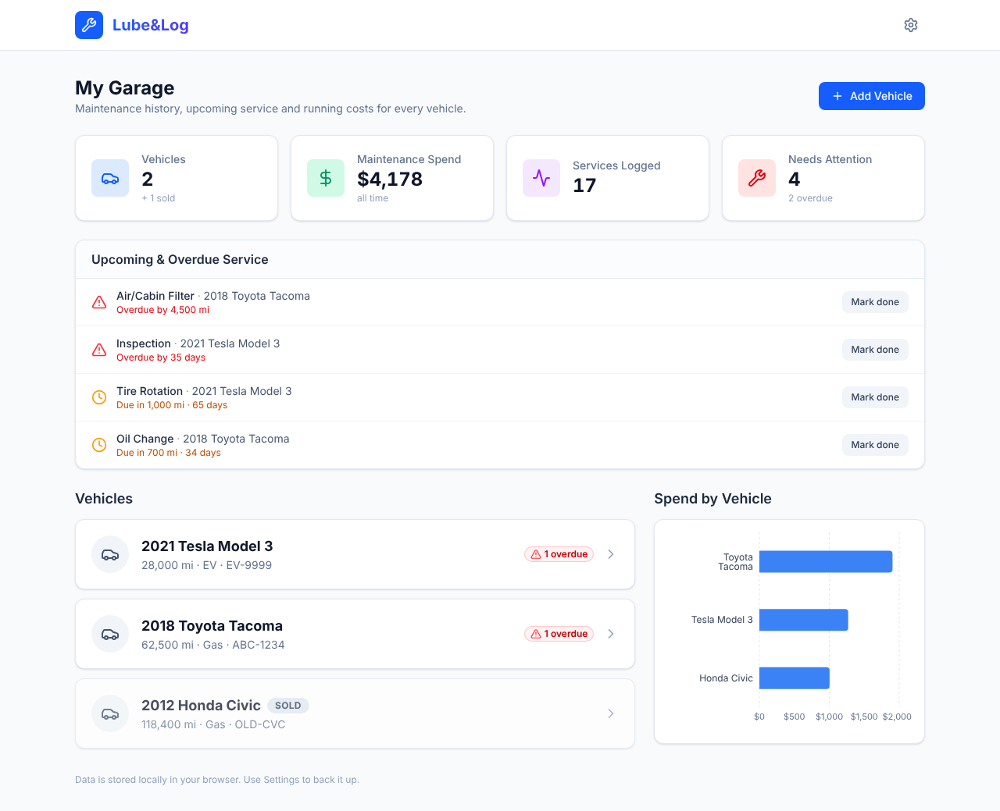
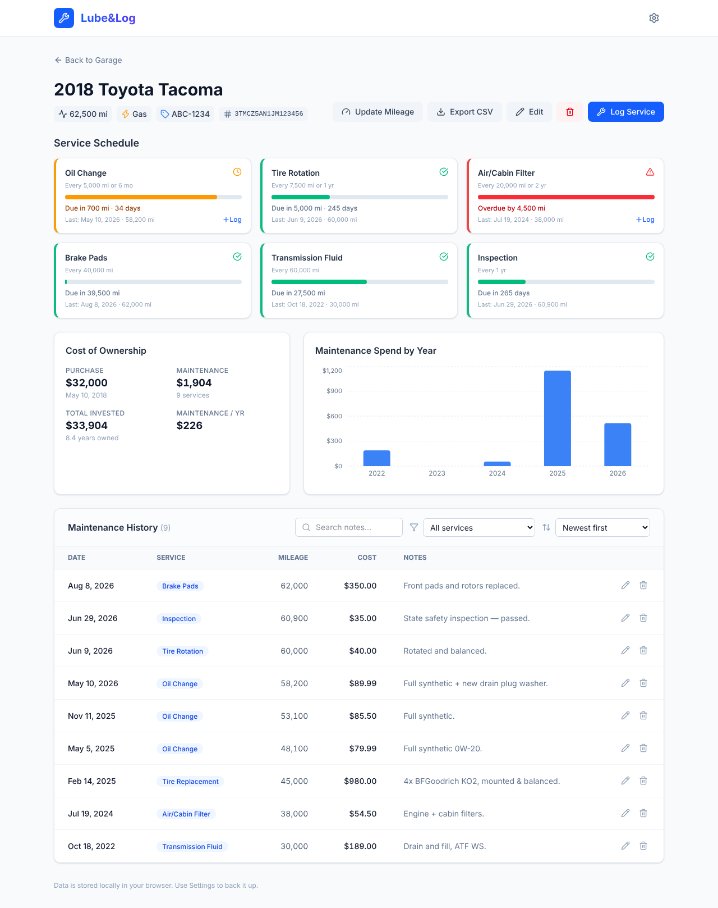
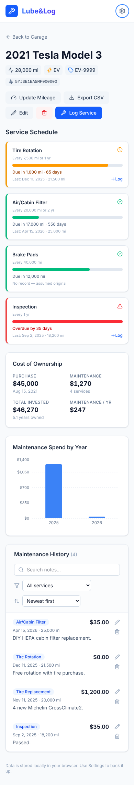

# Lube&Log: a vehicle maintenance tracker

**Live demo:** https://drdayman.github.io/mygarage/ · Built for the One Day Build Challenge.

Lube&Log keeps a record of every vehicle you own and every service done on it, and it tells you what needs doing next. You can add a car in seconds by decoding its VIN. You can log oil changes, tire rotations and other work, and see which services are coming due or overdue across all your vehicles. It also shows what each vehicle has really cost you over the years you've owned it.



---

## Features

| | |
|---|---|
| **Garage dashboard** | Shows all vehicles with a status badge on each one (*Up to date* / *N due soon* / *N overdue*), totals for spending and services, and a chart of spending per vehicle. |
| **Upcoming & overdue service** | One list for all the vehicles you still own, with the most urgent items first. **Mark done** opens the service form already filled in for that vehicle and service type. |
| **Service schedule engine** | Each service is due after a number of miles, a number of months, or **whichever comes first** (the same way owner's manuals put it). Rules depend on fuel type, so an EV never gets an oil change reminder. Each card has a progress bar, the time or miles left, and when the service was last done. |
| **VIN decoder** | Paste a 17-character VIN and the app fills in make, model, year and fuel type from the free [NHTSA vPIC API](https://vpic.nhtsa.dot.gov/api/). The VIN is checked locally first (length, no I/O/Q). If the API can't be reached you can still type everything in by hand. |
| **Maintenance history** | Full add/edit/delete, with search, a filter by service type, and sorting by date, cost or mileage. Logging a service at a higher mileage moves the odometer up automatically. On phones the history shows as stacked cards. |
| **Cost of ownership** | Purchase price + maintenance − sale price gives the net cost. It also shows cost per year owned and maintenance spending per calendar year. Sold vehicles keep their history, and their reminders turn off. |
| **Your data, portable** | Everything is saved in `localStorage`. From **Settings** you can download or restore a JSON backup, export every service to CSV (safe to open in Excel or Sheets), reload the demo data, or erase everything. |
| **Validation** | Required fields, sensible ranges for year and mileage, no dates in the future, sold date after purchase date. The odometer can't be set below the highest mileage in the service records. |
| **Details** | Links like `#/vehicles/v1` survive a refresh and the back button works. Escape closes dialogs, focus is managed, and labels and ARIA are in place. Toasts and confirmation dialogs appear for anything destructive. The layout works on phones. |

<p>
  
  
</p>

## Getting started

Requires **Node.js 20+**.

```bash
git clone https://github.com/DrDayman/mygarage.git
cd mygarage
npm install
npm run dev          # http://localhost:5173
```

The app starts with a demo garage (a Tacoma, a Tesla, and a Civic that was sold) so every feature has something to show. To start empty, choose **Settings → Erase all data**.

| Script | What it does |
|---|---|
| `npm run dev` | Dev server with hot reload |
| `npm test` | Runs the Vitest suite (unit + UI integration tests) |
| `npm run typecheck` | Strict TypeScript check |
| `npm run build` | Type-checks and builds a production bundle into `dist/` |
| `npm run preview` | Serves the production build locally |

### Deploying

`.github/workflows/deploy.yml` builds and publishes to GitHub Pages on every push to `main`. You only need to set it up once: **Settings → Pages → Source: GitHub Actions**. The output is a static site, so `dist/` also works on Netlify, Vercel or any static host. Set the `VITE_BASE` env var if you serve it from a sub-path.

## Tech stack

- **React 19 + TypeScript** (strict mode) on **Vite**
- **Tailwind CSS v4** for styling, **lucide-react** for icons, **Recharts** for charts
- **Vitest + Testing Library** for tests
- **NHTSA vPIC** public API for VIN decoding (no API key needed)
- **GitHub Actions** for CI (typecheck → test → build) and the Pages deployment

## Project structure

```
src/
├── App.tsx                 # Shell: nav, routing, dialog orchestration, toasts
├── types.ts                # Domain model: Vehicle, MaintenanceLog, enums
├── lib/                    # Pure, framework-free logic, all unit-tested
│   ├── maintenance.ts      #   Service schedule engine (rules, health, fleet alerts)
│   ├── stats.ts            #   Cost of ownership, spend by year
│   ├── vin.ts              #   VIN validation + NHTSA decoding/mapping
│   ├── storage.ts          #   localStorage I/O, backup format + validation
│   ├── csv.ts              #   CSV export (RFC 4180 + formula-injection guard)
│   └── format.ts           #   Local-date math, currency/mileage formatting
├── hooks/
│   ├── useGarage.ts        #   All state + mutations, persisted to localStorage
│   ├── useHashRoute.ts     #   Tiny hash router (deep links + back button)
│   └── useToasts.ts        #   Toast queue
├── views/                  # Dashboard, VehicleDetail
├── components/             # UI primitives, health cards, forms, settings
└── data/seed.ts            # Demo data, generated relative to today
```

**How the code is organised:** all business logic lives in `src/lib` as pure functions that take plain data (and an explicit `today`) and return plain data. React components only display results and pass user actions up. That split is why the schedule engine can be tested on exact dates without mocking anything. It also means the storage layer could become a REST/SQLite backend without touching the UI.

## How the service schedule works

```ts
{ serviceType: 'Oil Change',  miles: 5_000, months: 6, fuelTypes: ['Gas', 'Diesel', 'Hybrid'] }
{ serviceType: 'Brake Pads',  miles: 40_000 }
{ serviceType: 'Inspection',  months: 12 }
```

For each rule that applies to the vehicle:

1. Find the **most recent** log of that service type (by mileage, then date).
2. Work out what fraction of the interval has been used, both **by miles** (`odometer − mileage at last service`) and **by time** (`today − date of last service`). Use the larger of the two.
3. Below 85% is **Good**, 85% to 100% is **Due soon**, and 100% or more is **Overdue**. The text shows whichever limit is closer ("Overdue by 98 days" or "Due in 700 mi · 34 days").
4. **Never logged?** The app assumes the service hasn't been done since the vehicle was new: the mileage baseline is 0 and the time baseline is the purchase date (or January 1 of the model year). The card says "No record — assumed original" so the guess is visible.

## Design decisions & trade-offs

- **No backend, `localStorage` only.** Within one day I chose a polished, fully working client over a half-finished full-stack app. Backup and restore covers moving data between devices. All persistence goes through `useGarage` + `lib/storage`, so a server could replace it later.
- **Stored data is checked, not trusted.** Records from `localStorage` and from imported backups go through the same parser. Broken records and logs whose vehicle no longer exists are dropped, and unknown enum values fall back to defaults, so a bad file can't crash the app.
- **Dates are local calendar dates (`YYYY-MM-DD`).** `new Date('2024-05-10')` reads the date as UTC, which shows the *previous day* anywhere west of Greenwich. All date math goes through `parseLocalDate`.
- **The demo data is relative to today.** Service dates are generated as "N days ago", so the demo always shows a realistic mix of good, due-soon and overdue items whenever it's opened. A test checks this.
- **Hash routing, no router library.** There are two screens. A 30-line hook gives deep links and back-button support without another dependency.
- **One form component for add and edit.** The draft had separate add/edit forms with duplicated fields. Merging them means validation and the VIN decoder behave the same in both.

## Testing

```bash
npm test
```

There are 36 tests:

- **Schedule engine:** mileage-, time- and "whichever first" status; EV rules; the never-serviced baseline; picking the latest log; how alerts are sorted; and that the seed data covers every status.
- **Library code:** local-date parsing (including across a DST change), CSV escaping and formula injection, backup round-trip and rejection of bad files, VIN validation and NHTSA mapping, cost-of-ownership math.
- **UI integration (Testing Library):** first-run demo data; adding a vehicle → logging a service → odometer moves up → data persisted; form validation; VIN decode with a mocked API; deleting a vehicle behind a confirmation.

## What I'd build next

- **Accounts and sync:** a small API (e.g. Supabase or Postgres) so data follows the user between devices
- **Custom schedules per vehicle:** let owners change the intervals to match their manual or driving conditions
- **Reminders:** email or push notifications when something becomes due soon, plus mileage forecasts from average miles per day
- **Receipts:** attach photos or PDFs to service records
- **Fuel / charging log:** MPG and cost-per-mile tracking

## Use of AI

As the challenge encouraged, I used AI assistants during the build: to speed up scaffolding and boilerplate, to review my draft for bugs (timezone date shifts, a toast timer that kept resetting, a mobile layout overflow), and to help write tests. I made the product decisions, the data model and the scheduling rules myself, and I reviewed and tested every change.
